<p align="center">
  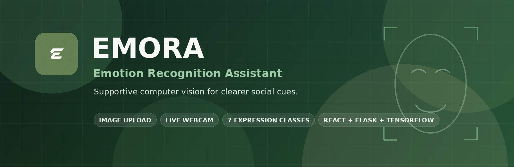
</p>

<p align="center">
  <a href="https://emora-emotion-recognition-assistant.vercel.app/"></a>
  <a href="https://github.com/anamta-JINX/Emora-EmotionRecognitionAssistant"></a>
  <a href="./LICENSE"></a>
</p>

<p align="center">
  
  
  
  
  
  
  
</p>

# EMORA — Emotion Recognition Assistant

> **An assistive facial-expression recognition platform designed to make social cues easier to approach—without treating an AI prediction as certainty.**

EMORA is a full-stack computer-vision application that detects visible faces in uploaded images or webcam frames, classifies each face into one of seven facial-expression categories, and returns an annotated result through a calm, accessible React interface.

The project was created with neurodivergent accessibility in mind, including people who may find facial expressions difficult to interpret consistently. EMORA is intended to provide a **supportive cue**, not replace communication, context, empathy, or professional judgement.

<p align="center">
  <a href="https://emora-emotion-recognition-assistant.vercel.app/"><strong>Launch the live application →</strong></a>
  &nbsp;&nbsp;•&nbsp;&nbsp;
  <a href="mailto:anamta.gohar25@gmail.com"><strong>Collaboration contact →</strong></a>
</p>

---

## Table of contents

- [Abstract](#abstract)
- [Demo](#demo)
- [Interface tour](#interface-tour)
- [Core capabilities](#core-capabilities)
- [Supported expressions](#supported-expressions)
- [How EMORA works](#how-emora-works)
- [System architecture](#system-architecture)
- [Model architecture and training](#model-architecture-and-training)
- [Evaluation snapshot](#evaluation-snapshot)
- [Technology stack](#technology-stack)
- [Project structure](#project-structure)
- [API reference](#api-reference)
- [Getting started](#getting-started)
- [Configuration](#configuration)
- [Testing](#testing)
- [Deployment](#deployment)
- [Responsible use and privacy](#responsible-use-and-privacy)
- [Troubleshooting](#troubleshooting)
- [Future enhancements](#future-enhancements)
- [Collaboration](#collaboration)
- [License](#license)

---

## Abstract

Interpreting facial expressions can be difficult, inconsistent, or cognitively demanding for some people. EMORA explores how computer vision can provide an optional visual cue during everyday interactions.

The system accepts an image or a compressed webcam frame, applies OpenCV-based face preparation, converts the detected face to a normalized **48 × 48 grayscale tensor**, and sends it through a TensorFlow/Keras convolutional neural network. The Flask API then returns the dominant expression label together with an annotated image. The React frontend presents the result using careful language and a suggested next step while repeatedly reminding the user that expression recognition is not mind reading.

### Project goals

- Make facial-expression cues easier to access through a focused interface.
- Support both uploaded images and live webcam capture.
- Preserve a clear separation between frontend, API, inference, training, and evaluation code.
- Keep error states understandable: offline API, missing model, invalid image, no face, camera denial, and timeout.
- Frame every prediction responsibly as a clue rather than a fact about someone’s internal state.

---

## Demo

<p align="center">
  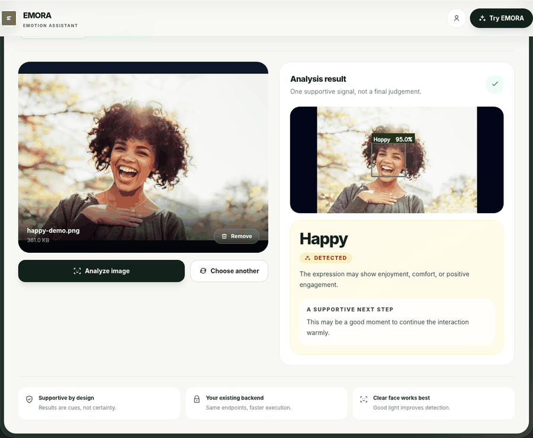
</p>

### Application overview

<p align="center">
  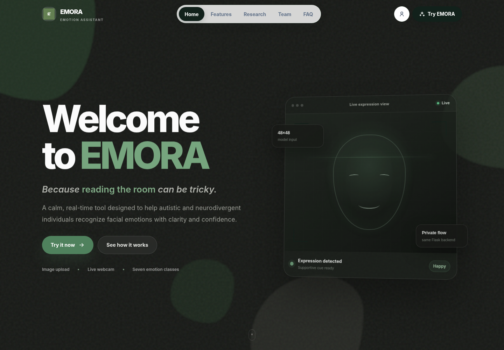
</p>

### Successful expression states

<table>
  <tr>
    <td align="center"><strong>Happy</strong><br>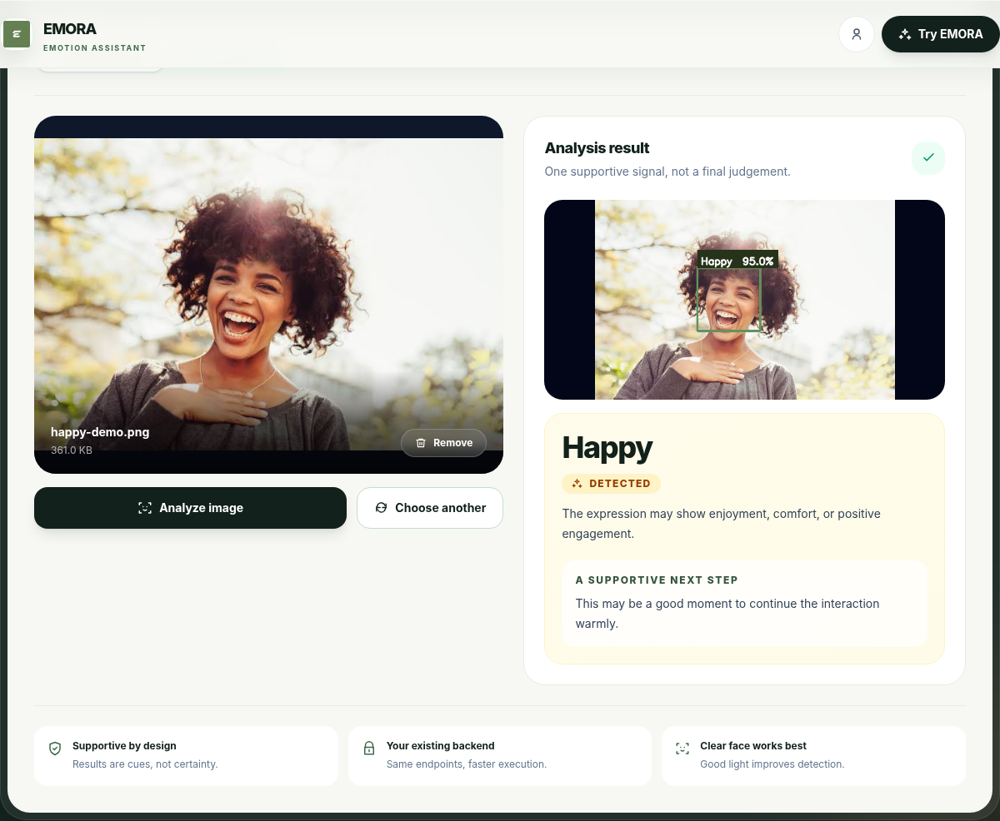</td>
    <td align="center"><strong>Sad</strong><br>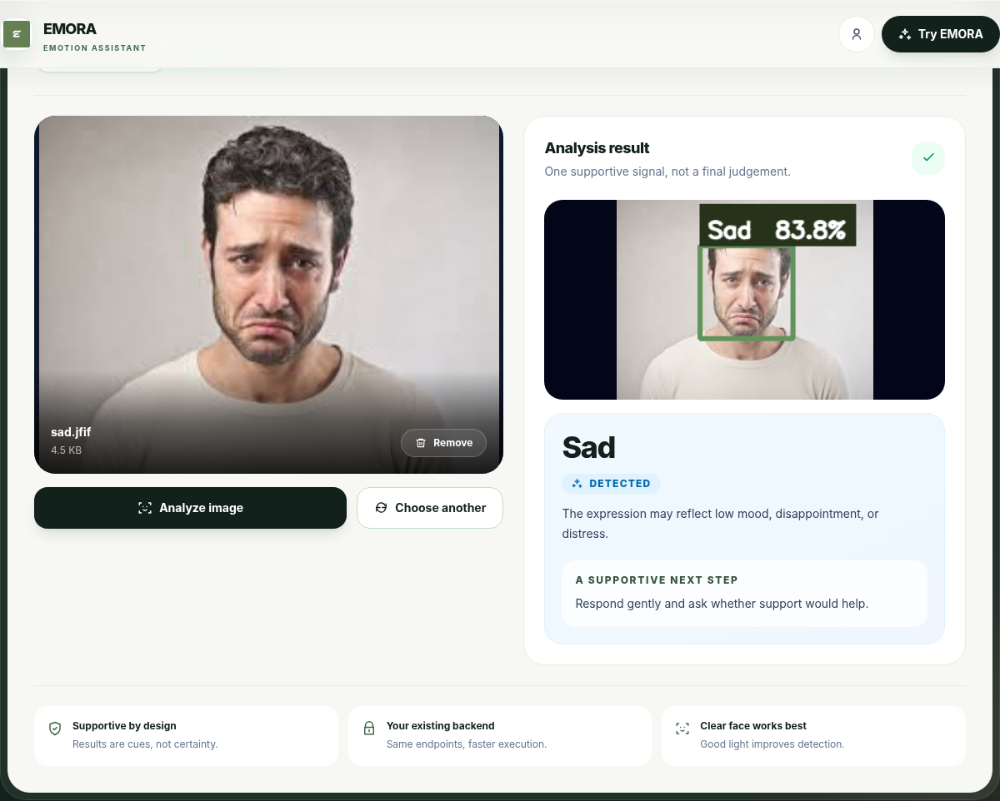</td>
  </tr>
  <tr>
    <td align="center"><strong>Angry</strong><br>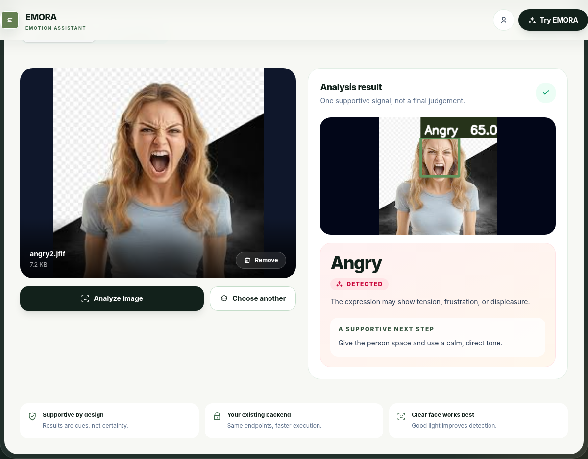</td>
    <td align="center"><strong>Surprise</strong><br>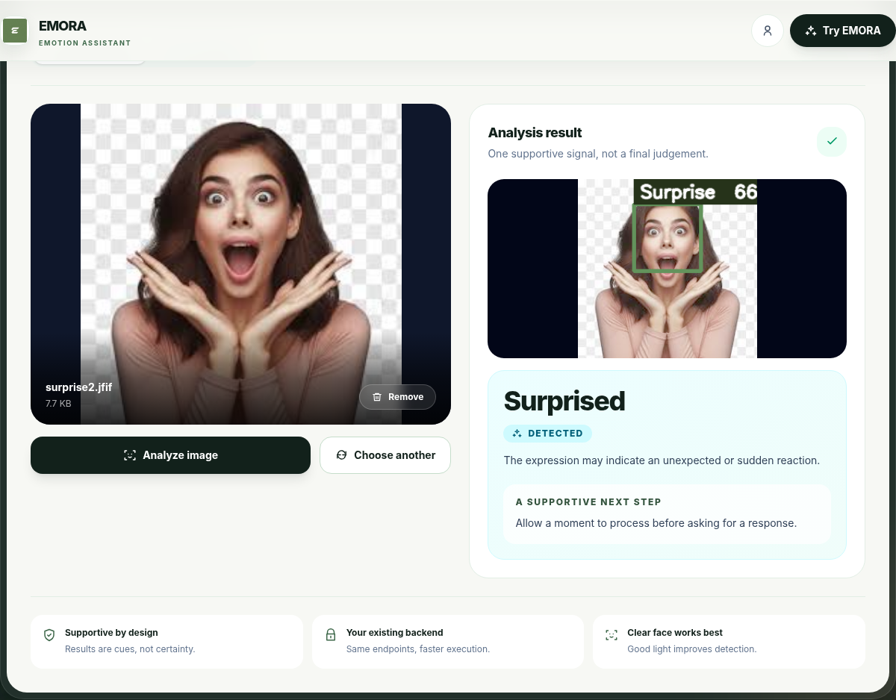</td>
  </tr>
  <tr>
    <td align="center"><strong>Fear</strong><br>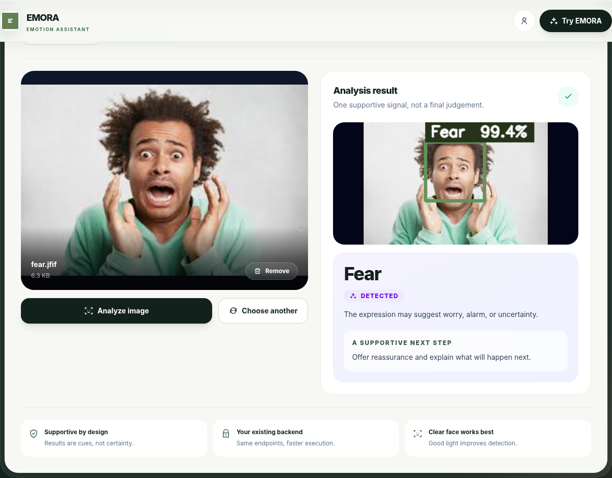</td>
    <td align="center"><strong>Disgust</strong><br>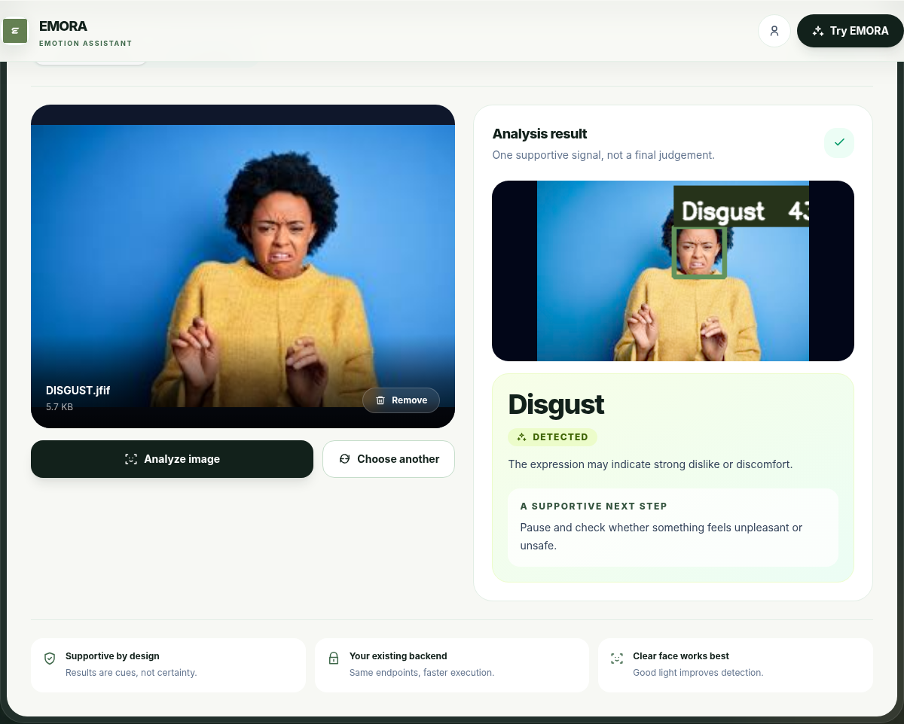</td>
  </tr>
</table>

> [!NOTE]
> Every result shown above is a **successful model-backed capture**. The displayed real-face image was processed through EMORA’s upload workflow and the project’s trained `emora_model.h5`; only cases whose returned class matched the visible test expression were retained. These examples demonstrate the product flow and are not a substitute for a formal accuracy or fairness evaluation.

### Verified demo matrix

| Test expression | EMORA output | Winning softmax score | Included |
|---|---|---:|:---:|
| Happy | Happy | 95.0% | ✅ |
| Sad | Sad | 83.8% | ✅ |
| Angry | Angry | 65.0% | ✅ |
| Surprise | Surprise | 66.9% | ✅ |
| Fear | Fear | 99.4% | ✅ |
| Disgust | Disgust | 43.0% | ✅ |

> The winning softmax score is shown only to document the captured run. It is not a calibrated probability that the person is truly feeling that emotion.


---

## Interface tour

EMORA uses one consistent React design system across the public product pages and analysis workspace.

<table>
  <tr>
    <td align="center"><strong>Home</strong><br></td>
    <td align="center"><strong>Features</strong><br>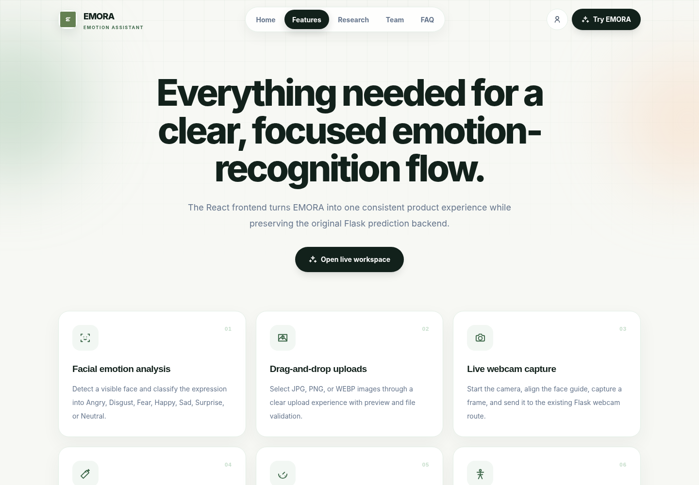</td>
  </tr>
  <tr>
    <td align="center"><strong>Research</strong><br>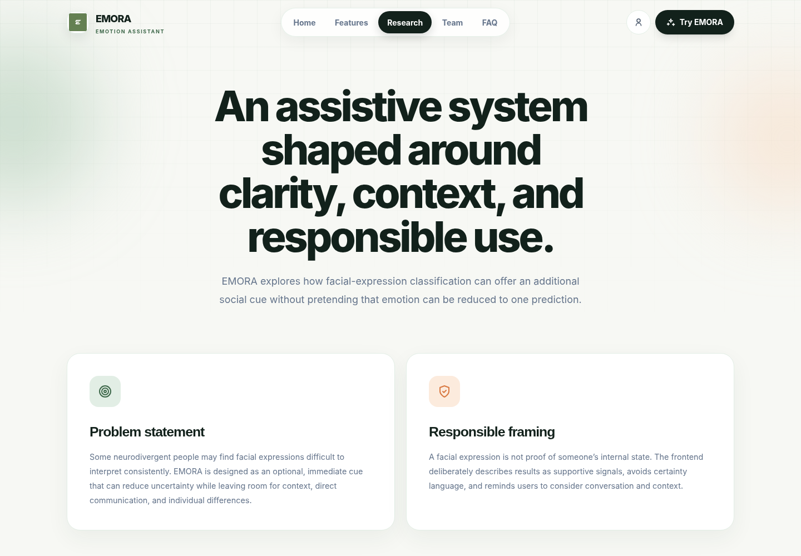</td>
    <td align="center"><strong>Team</strong><br>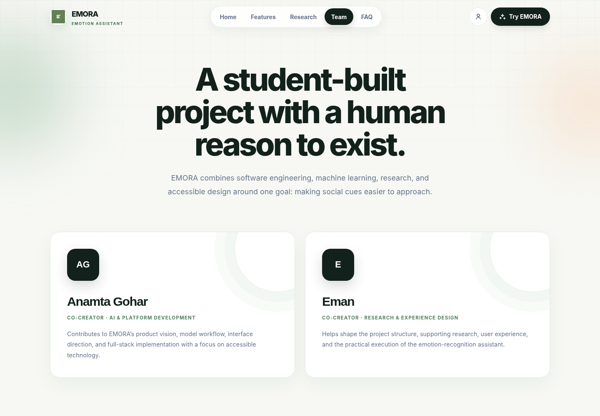</td>
  </tr>
  <tr>
    <td colspan="2" align="center"><strong>FAQ</strong><br>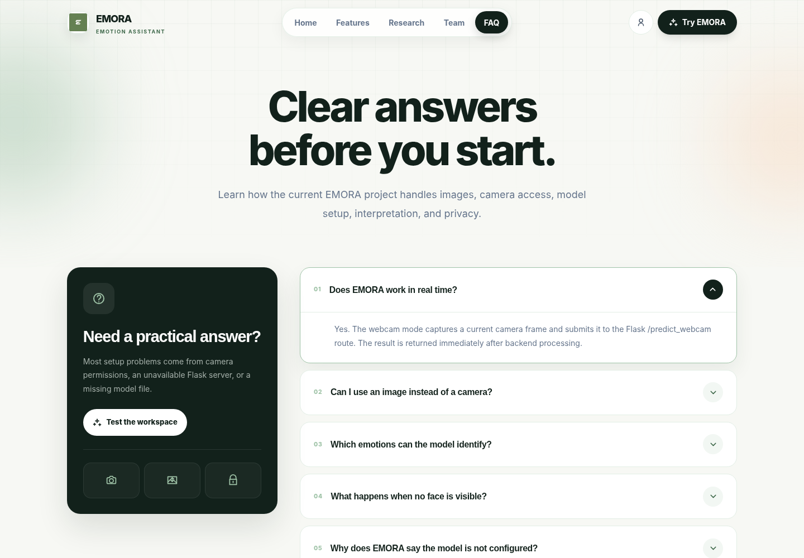</td>
  </tr>
</table>

The central workspace supports image upload and webcam capture, reports API availability, displays the annotated frame, explains the detected class in careful language, and suggests a context-sensitive next step.

---

## Core capabilities

| Capability | What it provides |
|---|---|
| **Image analysis** | Native file picker, drag-and-drop, validation, preview, replacement, removal, and analysis for JPG, PNG, and WEBP images. |
| **Webcam analysis** | Permission request, live preview, mirrored capture, compressed JPEG payload, prediction, and safe stream shutdown. |
| **Seven-class classification** | Angry, Disgust, Fear, Happy, Sad, Surprise, and Neutral. |
| **Face annotation** | Returns the processed frame with a visible face box and the predicted label. |
| **Fast webcam path** | Reduces webcam width to at most 640 px and predicts the largest visible face for lower latency. |
| **Warm model startup** | Optionally loads and traces the TensorFlow model while Flask starts, avoiding a large first-request delay. |
| **Feedback learning workflow** | Stores corrected 48 × 48 samples locally and can fine-tune an optional feedback model without overwriting the base model. |
| **Accessible interface** | Large controls, clear hierarchy, responsive layouts, reduced-motion support, readable statuses, and low-overload visual design. |
| **Clear failure states** | Friendly handling for invalid files, no detected face, unavailable API, missing model, denied camera access, and prediction timeouts. |
| **Modular architecture** | React SPA, Flask application factory, API routes, image utilities, inference service, training scripts, and evaluation outputs. |

---

## Supported expressions

| Label | Interface framing | Suggested response shown by EMORA |
|---|---|---|
| **Angry** | May show tension, frustration, or displeasure. | Give the person space and use a calm, direct tone. |
| **Disgust** | May indicate strong dislike or discomfort. | Pause and check whether something feels unpleasant or unsafe. |
| **Fear** | May suggest worry, alarm, or uncertainty. | Offer reassurance and explain what will happen next. |
| **Happy** | May show enjoyment, comfort, or positive engagement. | Continue the interaction warmly. |
| **Sad** | May reflect low mood, disappointment, or distress. | Respond gently and ask whether support would help. |
| **Surprise** | May indicate an unexpected or sudden reaction. | Allow a moment to process before asking for a response. |
| **Neutral** | Appears relatively calm or emotionally unclear. | Use context and conversation rather than relying on expression alone. |

---

## How EMORA works


```mermaid
flowchart LR
    A[Image upload or webcam frame] --> B[Decode into OpenCV BGR image]
    B --> C[Gamma adjustment]
    C --> D[Grayscale conversion]
    D --> E[CLAHE contrast enhancement]
    E --> F[Haar cascade face detection]
    F -->|No face| G[Return readable no-face state]
    F -->|Face found| H[Crop and resize to 48 × 48]
    H --> I[Normalize to 0–1]
    I --> J[TensorFlow / Keras CNN]
    J --> K[Seven-class softmax output]
    K --> L[Optional base + feedback ensemble]
    L --> M[Draw bounding box and label]
    M --> N[Return label + annotated data URL]
    N --> O[React success-state card]
```

### Request lifecycle

1. The browser validates the input and creates a local preview.
2. React sends multipart image data to `POST /predict_image`, or a base64 JPEG frame to `POST /predict_webcam`.
3. Flask decodes the request into an OpenCV image.
4. EMORA applies gamma correction, grayscale conversion, and CLAHE.
5. A Haar cascade locates visible faces.
6. Each selected face is resized to `48 × 48 × 1` and normalized.
7. The CNN returns seven class probabilities.
8. When a feedback model exists, its probabilities are blended with the base model using the configured ensemble weight.
9. OpenCV draws the face rectangle and label.
10. Flask returns the dominant label and an annotated PNG/JPEG data URL.

---

## System architecture

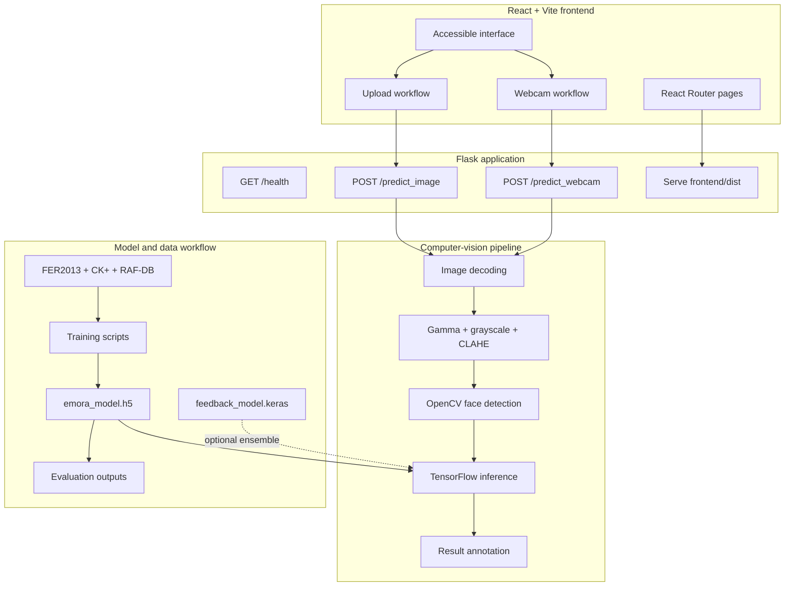
```mermaid
flowchart TB
    subgraph Browser[React + Vite frontend]
      UI[Accessible interface]
      Upload[Upload workflow]
      Camera[Webcam workflow]
      Router[React Router pages]
    end

    subgraph API[Flask application]
      Health[GET /health]
      ImageAPI[POST /predict_image]
      WebcamAPI[POST /predict_webcam]
      SPA[Serve frontend/dist]
    end

    subgraph Vision[Computer-vision pipeline]
      Decode[Image decoding]
      Face[OpenCV face detection]
      Prep[Gamma + grayscale + CLAHE]
      Infer[TensorFlow inference]
      Annotate[Result annotation]
    end

    subgraph ML[Model and data workflow]
      Base[emora_model.h5]
      Feedback[feedback_model.keras]
      Data[FER2013 + CK+ + RAF-DB]
      Train[Training scripts]
      Eval[Evaluation outputs]
    end

    UI --> Upload --> ImageAPI
    UI --> Camera --> WebcamAPI
    Router --> SPA
    ImageAPI --> Decode
    WebcamAPI --> Decode
    Decode --> Prep --> Face --> Infer --> Annotate
    Base --> Infer
    Feedback -. optional ensemble .-> Infer
    Data --> Train --> Base
    Base --> Eval
```

---

## Model architecture and training

The training script builds `emora_cnn_v2`, a grayscale seven-class CNN designed for `48 × 48` facial crops.

### Network

```text
Input: 48 × 48 × 1
│
├── Data augmentation
│   ├── Random horizontal flip
│   ├── Random rotation (0.08)
│   ├── Random zoom (0.10)
│   ├── Random translation (0.06, 0.06)
│   └── Random contrast (0.15)
│
├── Block 1: Conv 64 → BN → ReLU → Conv 64 → BN → ReLU → MaxPool → Dropout 0.25
├── Block 2: Conv 128 → BN → ReLU → Conv 128 → BN → ReLU → MaxPool → Dropout 0.30
├── Block 3: Conv 256 → BN → ReLU → Conv 256 → BN → ReLU → MaxPool → Dropout 0.35
├── Block 4: Conv 256 → BN → ReLU → Conv 256 → BN → ReLU → MaxPool → Dropout 0.40
│
├── GlobalAveragePooling2D
├── Dense 256 + ReLU + L2 regularisation
├── Dropout 0.50
└── Dense 7 + Softmax
```

### Training configuration

| Setting | Value |
|---|---|
| Optimiser | Adam |
| Initial learning rate | `1e-3` |
| Loss | Categorical cross-entropy |
| Batch size | `64` |
| Maximum epochs | `60` |
| Validation split | `0.15` |
| Weight decay | `1e-4` |
| Early stopping | `val_accuracy`, patience `7` |
| LR reduction | `val_loss`, factor `0.5`, patience `3`, minimum `1e-6` |
| Checkpoint | Best `val_accuracy` saved to `backend/models/emora_model.h5` |

### Dataset unification

The preprocessing pipeline combines three sources into a shared seven-label order:

```text
0 Angry • 1 Disgust • 2 Fear • 3 Happy • 4 Sad • 5 Surprise • 6 Neutral
```

- **FER2013** — CSV pixel data already aligned to the seven-class order.
- **CK+** — folder labels are mapped to the shared classes; unsupported contempt samples are ignored.
- **RAF-DB** — numeric folder labels are remapped to the EMORA class order.

All inputs are converted to grayscale, resized to `48 × 48`, normalized to `[0, 1]`, one-hot encoded, and saved to:

```text
backend/data/preprocessed/images_labels.npz
```

> Dataset files are not automatically redistributable. Follow each dataset’s original licence and access terms.

---

## Evaluation snapshot

The repository’s checked-in `classification_report.txt` records an evaluation over **52,153 samples**.

| Metric | Value |
|---|---:|
| Accuracy | **0.75** |
| Macro precision | 0.73 |
| Macro recall | 0.69 |
| Macro F1 | **0.70** |
| Weighted precision | 0.75 |
| Weighted recall | 0.75 |
| Weighted F1 | **0.74** |

### Per-class results

| Class | Precision | Recall | F1 | Support |
|---|---:|---:|---:|---:|
| Angry | 0.70 | 0.69 | 0.70 | 6,707 |
| Disgust | 0.82 | 0.56 | 0.66 | 1,079 |
| Fear | 0.65 | 0.45 | 0.53 | 6,073 |
| Happy | 0.92 | 0.91 | 0.91 | 15,153 |
| Sad | 0.62 | 0.61 | 0.61 | 7,028 |
| Surprise | 0.80 | 0.80 | 0.80 | 7,455 |
| Neutral | 0.62 | 0.80 | 0.70 | 8,658 |

<p align="center">
  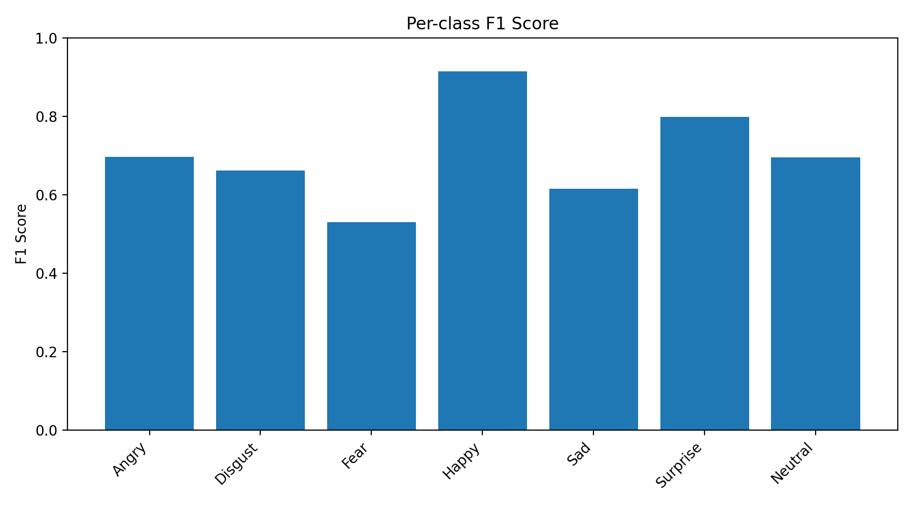
</p>

<details>
  <summary><strong>View confusion matrices</strong></summary>
  <br>
  <p align="center">
    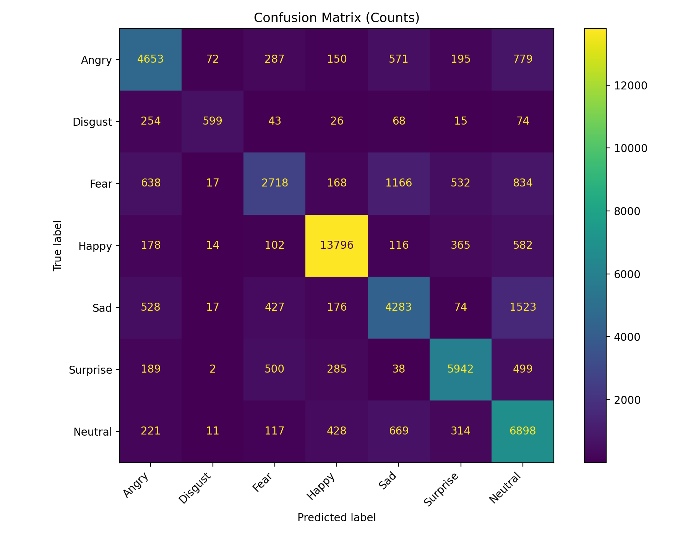
    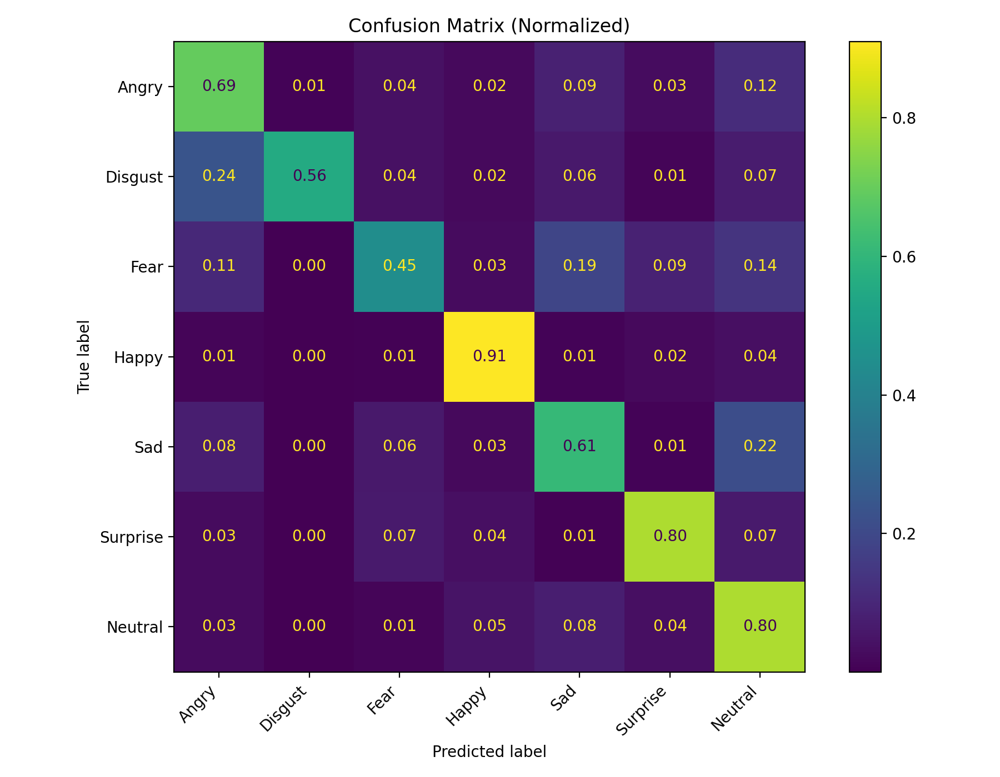
  </p>
</details>

> [!IMPORTANT]
> These figures are a stored project snapshot, not a universal guarantee. Regenerate the report whenever the model, preprocessing pipeline, dataset composition, or split changes. Facial-expression performance can also vary substantially across lighting, pose, occlusion, camera quality, and demographic groups.

Run evaluation with:

```bash
python -m backend.scripts.evaluate_emora
```

---

## Technology stack

### Artificial intelligence and computer vision

| Technology | Purpose |
|---|---|
| Python 3.10 | Core language for the API, inference, data processing, training, and evaluation. |
| TensorFlow 2.18 / Keras | CNN definition, training, model loading, and inference. |
| OpenCV 4.10 | Image decoding, preprocessing, face detection, resizing, annotation, and encoding. |
| NumPy 1.26 | Tensor preparation and probability operations. |
| Scikit-learn | Classification report and confusion-matrix generation in the training environment. |
| Matplotlib | Evaluation charts. |

### Backend

| Technology | Purpose |
|---|---|
| Flask 3.1 | REST endpoints, application factory, health route, and React build serving. |
| REST/JSON | Communication between the browser and inference pipeline. |
| Git LFS | Storage for model, dataset, archive, CSV, and image artefacts configured by `.gitattributes`. |

### Frontend

| Technology | Purpose |
|---|---|
| React 18.3 | Component-based application UI and state management. |
| React Router 6.28 | Client-side page routing. |
| Vite 6.0 | Development server and production build. |
| Tailwind CSS 3.4 | Responsive design system and utility styling. |
| Lucide React | Consistent interface icons. |

### Delivery

| Technology | Purpose |
|---|---|
| Vercel | Hosted preview through the Flask project configuration. |
| Pytest | Structural and speed-regression checks. |
| GitHub | Source control, issue tracking, and project documentation. |

---

## Project structure

```text
Emora-EmotionRecognitionAssistant/
├── app.py                              # Flask/Vercel entrypoint
├── frontend/
│   ├── index.html                      # Vite development entry
│   ├── src/
│   │   ├── components/                 # Navbar, footer, live workspace, reusable UI
│   │   ├── pages/                      # Home, Features, Research, Team, FAQ, etc.
│   │   ├── App.jsx                     # Router and shared layout
│   │   ├── main.jsx                    # React entrypoint
│   │   └── index.css                   # Tailwind layers and custom animations
│   ├── dist/                           # Production SPA served by Flask
│   │   ├── index.html
│   │   ├── assets/
│   │   └── imgs/
│   ├── package.json
│   ├── vite.config.js
│   ├── tailwind.config.js
│   └── postcss.config.js
├── backend/
│   ├── app/
│   │   ├── __init__.py                 # Flask application factory and model preload
│   │   ├── config.py                   # Central path and environment configuration
│   │   ├── routes/
│   │   │   ├── pages.py                # React SPA routes
│   │   │   └── predictions.py          # Image and webcam prediction APIs
│   │   ├── services/
│   │   │   ├── emotion_service.py      # Model loading, preprocessing, inference, feedback
│   │   │   └── face_detector.py        # Optional DNN face-detector support
│   │   └── utils/
│   │       └── images.py               # Upload/base64 decode and PNG/JPEG encode helpers
│   ├── scripts/
│   │   ├── preprocess_datasets.py      # FER2013, CK+, and RAF-DB preprocessing
│   │   ├── train_model.py              # CNN training
│   │   ├── evaluate_emora.py           # Metrics and charts
│   │   ├── manualtrain.py              # Feedback correction workflow
│   │   ├── emora_gui.py                # Desktop workflow
│   │   └── app_modified_image.py
│   ├── models/
│   │   ├── emora_model.h5              # Base model
│   │   └── feedback_model.keras        # Optional fine-tuned feedback model
│   ├── data/
│   │   ├── datasets/                    # Raw datasets
│   │   ├── preprocessed/                # images_labels.npz
│   │   ├── feedback_data/               # Opt-in corrected samples
│   │   ├── evaluation_outputs/          # Reports, predictions, and charts
│   │   └── archives/
│   └── resources/face_detector/         # Optional Caffe DNN detector files
├── docs/
│   ├── assets/                          # README banner, GIF, screenshots, inputs, charts
│   └── Emora Documentation.pdf
├── archive/legacy/                      # Preserved legacy material
├── tests/
├── .env.example
├── .gitattributes
├── .gitignore
├── .vercelignore
├── requirements.txt                    # Web runtime
├── requirements-training.txt           # Training/evaluation/desktop dependencies
├── TESTING.md
├── PROJECT_STRUCTURE.md
├── vercel.json
├── LICENSE
└── README.md
```

---

## API reference

### Health check

```http
GET /health
```

```json
{
  "status": "healthy",
  "service": "EMORA API"
}
```

### Analyze an uploaded image

```http
POST /predict_image
Content-Type: multipart/form-data
```

Form field:

```text
image=<JPG, PNG, or WEBP file>
```

Example:

```bash
curl -X POST \
  -F "image=@face.jpg" \
  http://127.0.0.1:5000/predict_image
```

### Analyze a webcam frame

```http
POST /predict_webcam
Content-Type: application/json
```

```json
{
  "image": "data:image/jpeg;base64,..."
}
```

### Successful response

```json
{
  "label": "Happy",
  "image_base64": "data:image/png;base64,..."
}
```

The webcam route returns a compact JPEG data URL; the upload route returns PNG.

### Common error responses

| HTTP status | Meaning |
|---:|---|
| `400` | Missing or invalid image data. |
| `200` with `label: null` | No clear face was detected in the processed frame. |
| `503` | The base model is missing or not configured. |
| `500` | Inference failed unexpectedly. |

---

## Getting started

### Prerequisites

- Python **3.10** recommended
- Git
- Git LFS
- Node.js **18+** only when modifying the React source
- A webcam for live capture testing

### 1. Clone the repository

```bash
git clone https://github.com/anamta-JINX/Emora-EmotionRecognitionAssistant.git
cd Emora-EmotionRecognitionAssistant
```

### 2. Pull large model assets

```bash
git lfs install
git lfs pull
```

Verify that this is a real model file—not a small Git LFS pointer:

```text
backend/models/emora_model.h5
```

### 3. Create a Python environment

#### Windows PowerShell

```powershell
py -3.10 -m venv .venv
.\.venv\Scripts\Activate.ps1
python -m pip install --upgrade pip
pip install -r requirements.txt
```

#### macOS/Linux

```bash
python3.10 -m venv .venv
source .venv/bin/activate
python -m pip install --upgrade pip
pip install -r requirements.txt
```

### 4. Run EMORA

```bash
python app.py
```

Open:

```text
http://127.0.0.1:5000
```

The production React build is already stored in `frontend/dist`, so Node.js is not required merely to run the included web interface.

### 5. Develop the React frontend

Run Flask in one terminal, then:

```bash
cd frontend
npm install
npm run dev
```

Vite starts on:

```text
http://127.0.0.1:5173
```

Create a new production build with:

```bash
npm run build
```

Commit the updated `frontend/dist/` output when the deployment expects Flask to serve the compiled SPA.

### Training and evaluation environment

```bash
pip install -r requirements-training.txt
python -m backend.scripts.preprocess_datasets
python -m backend.scripts.train_model
python -m backend.scripts.evaluate_emora
```

---

## Configuration

Copy `.env.example` values into your environment as needed.

| Variable | Default | Purpose |
|---|---|---|
| `EMORA_BASE_MODEL_PATH` | `backend/models/emora_model.h5` | Override the base model location. |
| `EMORA_FEEDBACK_MODEL_PATH` | `backend/models/feedback_model.keras` | Override the optional feedback model. |
| `EMORA_DNN_PROTOTXT_PATH` | `backend/resources/face_detector/deploy.prototxt` | Optional Caffe detector configuration. |
| `EMORA_DNN_MODEL_PATH` | `backend/resources/face_detector/res10_300x300_ssd_iter_140000.caffemodel` | Optional Caffe detector weights. |
| `EMORA_MAX_UPLOAD_MB` | `10` | Intended upload-size configuration. |
| `EMORA_PRELOAD_MODEL` | `1` | Load and warm the model during Flask startup. |
| `FLASK_DEBUG` | `0` | Enable Flask debug mode locally when set to `1`. |
| `PORT` | `5000` | Flask port used by `app.py`. |

Example for PowerShell:

```powershell
$env:EMORA_PRELOAD_MODEL="1"
$env:FLASK_DEBUG="0"
python app.py
```

---

## Testing

### Automated checks

```bash
pytest -q
```

The project includes checks for source structure and latency-oriented implementation details.

### Manual web checklist

- [ ] `/health` returns a successful JSON response.
- [ ] All React routes render: `/`, `/features`, `/research`, `/team`, `/faq`, `/feedback`, `/profile`.
- [ ] Image picker opens and accepts JPG, PNG, or WEBP files.
- [ ] Drag-and-drop preview works.
- [ ] `POST /predict_image` returns an annotated result.
- [ ] Camera permission request is understandable.
- [ ] Webcam starts, captures, predicts, and releases its tracks after Stop.
- [ ] Missing model produces readable setup guidance rather than a blank page.
- [ ] No-face images produce a retry state.
- [ ] Desktop and mobile layouts have no horizontal overflow.


---

## Deployment

### Current preview

**https://emora-emotion-recognition-assistant.vercel.app/**

The repository includes:

```json
{
  "$schema": "https://openapi.vercel.sh/vercel.json",
  "framework": "flask"
}
```

### Deployment checklist

1. Build and commit `frontend/dist/`.
2. Confirm `backend/models/emora_model.h5` is available as the full Git LFS object.
3. Keep training datasets, archives, evaluation outputs, local GUI scripts, and unnecessary detector weights out of the serverless bundle through `.vercelignore`.
4. Confirm `/health` before testing predictions.
5. Test image inference after every deployment—not only the static React pages.

> [!WARNING]
> TensorFlow models can exceed serverless bundle, memory, and cold-start limits. For consistently fast production inference, consider a container host or a separate model service while keeping the Vercel frontend as the public interface.

---

## Responsible use and privacy

EMORA should be treated as an **assistive prototype**, not an authority on another person’s feelings.

- A facial expression does not prove an internal emotional state.
- Do not use EMORA for medical diagnosis, lie detection, policing, employment screening, grading, or covert surveillance.
- Obtain informed consent before analysing another person’s image or camera feed.
- Consider lighting, pose, occlusion, culture, disability, individual expression, and demographic bias.
- Prefer direct communication: ask the person how they feel instead of relying on a model label.
- Prediction frames are processed by the configured backend. Optional feedback workflows can save corrected face crops locally; enable them only with clear consent and suitable data protection.
- Do not commit private face images, raw user uploads, secrets, or unlicensed datasets to the repository.
- Documentation screenshots containing real faces do not transfer image rights. Confirm consent and publication rights before keeping or redistributing any face photograph. See [`docs/assets/PHOTO-NOTES.md`](./docs/assets/PHOTO-NOTES.md).

### Accessibility principles

- Calm visual hierarchy and limited cognitive overload.
- Large, clearly labelled controls.
- Readable success, loading, offline, no-face, and error states.
- Responsive layout across laptop, tablet, and mobile.
- Reduced-motion support.
- Context-sensitive language that avoids certainty and judgement.

---

## Troubleshooting

### `Emotion model is not configured`

The API cannot find the base model.

```text
backend/models/emora_model.h5
```

Run:

```bash
git lfs pull
```

Then restart Flask. If the file opens as plain text beginning with `version https://git-lfs.github.com/spec`, it is still an LFS pointer rather than the model object.

### First startup takes time

TensorFlow is loaded and warmed while Flask starts when:

```text
EMORA_PRELOAD_MODEL=1
```

Wait until startup completes before submitting the first frame.

### Camera does not start

- Use `http://localhost:5000`, `http://127.0.0.1:5000`, or HTTPS.
- Allow camera permission in the browser address bar.
- Close other applications currently using the webcam.
- Test in a current Chrome, Edge, or Firefox release.

### No face detected

Use a well-lit, front-facing image with one unobstructed face. Move closer, reduce extreme head rotation, and avoid heavy blur.

### Frontend changes do not appear

```bash
cd frontend
npm install
npm run build
```

Restart Flask and hard-refresh the browser.

### Vercel deployment is too large

Check `.vercelignore`, remove training-only data from the runtime bundle, and verify that only the required model is shipped. Large TensorFlow deployments may need a container or dedicated inference service.

---

## Future enhancements

The next product and research milestones should strengthen usefulness **without increasing certainty beyond what the model can justify**:

- **Confidence and calibration views** that show uncertainty instead of only a winning class.
- **Stronger face detection** for pose, occlusion, varied lighting, and multiple-face scenes.
- **Fairness evaluation** across demographic groups, datasets, camera quality, and accessibility contexts.
- **Formal model and dataset cards** covering training sources, limitations, intended use, and prohibited use.
- **On-device or edge inference** to reduce image transfer and improve privacy.
- **Consent-based feedback learning** with authentication, deletion controls, and transparent data retention.
- **Temporal smoothing for webcam mode** so labels do not flicker between frames.
- **Internationalisation and accessibility modes**, including simplified language, larger text, and screen-reader testing.
- **Containerised inference deployment** with health monitoring, reproducible builds, and model-version tracking.
- **Expanded automated testing** for API contracts, camera flows, model loading, and responsive layouts.

---

## Collaboration

EMORA is an owned project rather than an unrestricted open-source codebase. Suggestions, research discussion, accessibility feedback, and proposed collaboration are welcome, but reuse, modification, distribution, publication, or commercial deployment requires prior written permission from the licence holder.

For collaboration or licensing enquiries:

**Anamta Gohar**  
[anamta.gohar25@gmail.com](mailto:anamta.gohar25@gmail.com)  
GitHub: [@anamta-JINX](https://github.com/anamta-JINX)

The application’s Team page also credits **Eman** for research and experience-design contributions. Copyright and licensing authority remain solely with Anamta Gohar as requested in this repository licence.

---

## License

```text
Copyright © 2026 Anamta Gohar. All rights reserved.
```

This repository is **not released under MIT, Apache, GPL, or another permissive open-source licence**. No permission is granted to copy, modify, merge, publish, distribute, sublicense, sell, host, train from, or create derivative works from the project or its documentation without prior written authorisation from Anamta Gohar.

See [`LICENSE`](./LICENSE) for the complete terms. Collaboration and licensing requests may be sent to [anamta.gohar25@gmail.com](mailto:anamta.gohar25@gmail.com).

---

<p align="center">
  Built with computer vision, careful engineering, and room for human context.<br>
  <strong>EMORA — making emotions a little less mysterious.</strong>
</p>
